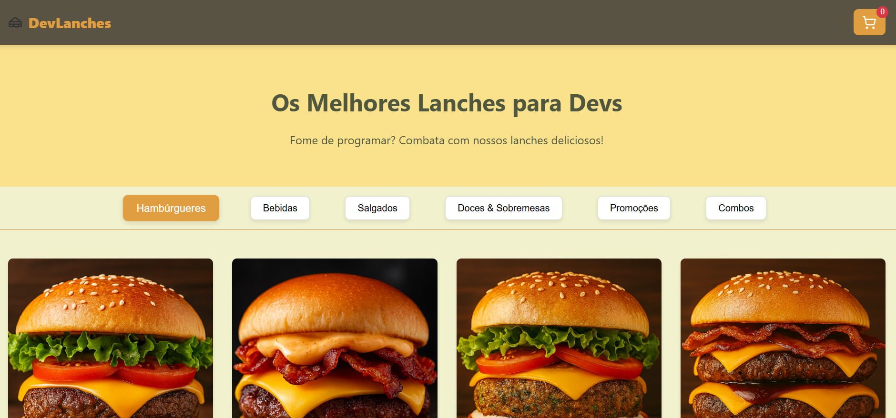
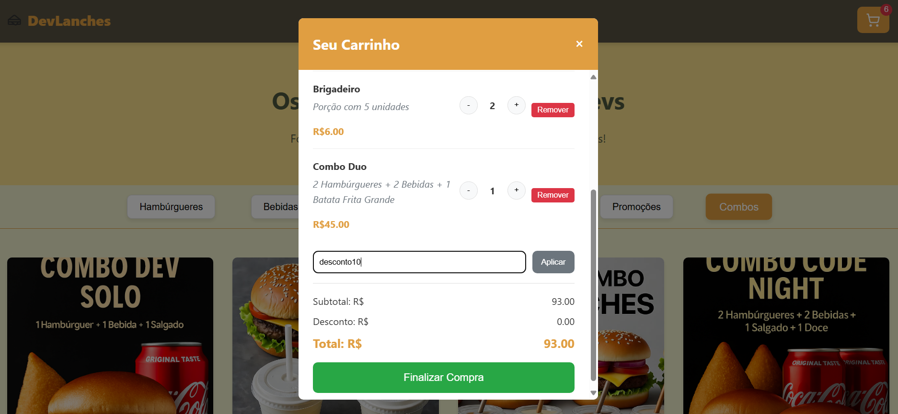

# Projeto DevLanches

Este é um projeto de cardápio de lanches fictício, desenvolvido com HTML, CSS e JavaScript.

## Visão Geral

O objetivo deste projeto é fornecer uma interface de usuário atraente para exibir o cardápio do DevLanches e permitir aos usuários adicionar itens ao carrinho de compras.

## Tela Inicial

## Carrinho de Compras

## Tecnologias Utilizadas

- HTML
- CSS
- JavaScript

## Como Executar

1. Clone este repositório
2. Abra o arquivo `index.html` em seu navegador

## Contribuição

Contribuições são sempre bem-vindas! Sinta-se à vontade para enviar um pull request com melhorias ou correções. Certifique-se de seguir as diretrizes de contribuição do projeto.

## Licença

Este projeto está licenciado sob a [MIT License](LICENSE).